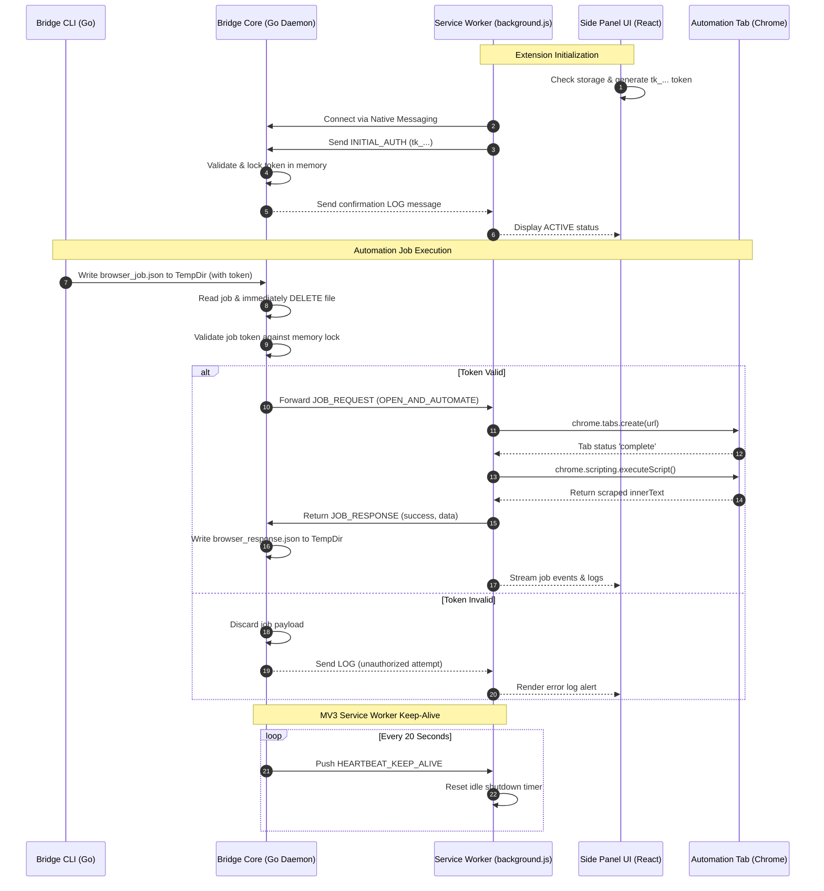

# System Design Specification: AI Browser Automation Platform

This design document outlines the technical architecture, zero-trust security model, IPC protocol framing, and runtime persistence strategies for the AI Browser Automation Platform.

---

## 🗺️ System Architecture

The platform operates across three isolated boundaries: the external CLI invocation layer, the local system runtime core, and the Chrome Extension runtime sandbox.



---

## 🔒 Zero-Trust Token Lock

To prevent unauthorized applications or local processes from hijacking control of the browser instance, the platform implements a strict **Zero-Trust Initialization Lock**:

1. **Token Generation**: On the extension's first launch, the React Side Panel [App.tsx](file:///home/qtopierw/workspace/projects/cosmos-chrome/frontend/src/App.tsx) generates a cryptographically secure 32-character string using `crypto.getRandomValues`, prepends it with `tk_`, and stores it in `chrome.storage.local`.
2. **daemon Initialization**: The Go daemon [main.go](file:///home/qtopierw/workspace/projects/cosmos-chrome/main.go) starts in an unauthenticated, blocked state. It reads from standard input but refuses to poll files or route automation commands.
3. **Locking Mechanism**: The background service worker [background.js](file:///home/qtopierw/workspace/projects/cosmos-chrome/frontend/public/background.js) reads the token from storage and dispatches it in an `INITIAL_AUTH` packet immediately upon connecting. The Go daemon validates that the token format is correct and locks it in memory (`validToken`).
4. **Read & Burn Validation**: 
   - External CLI commands must supply the token in their payload.
   - When Go polls the temporary directory (`os.TempDir()`), it opens the file `browser_job.json`, reads the data, and immediately issues `os.Remove()`.
   - The token in the payload is checked against the locked memory token. If they do not match, the payload is completely discarded, and an error log is pushed back to the Chrome client.

> [!IMPORTANT]
> The job file `browser_job.json` is deleted *before* processing begins. This ensures that even if a panic or early return occurs, the file is already scrubbed from disk, preventing re-read loops or persistent token exposure.

---

## 💬 Native Messaging Framing Protocol

Communication between the Chrome Service Worker and the Go core occurs over standard input (`os.Stdin`) and standard output (`os.Stdout`). Chrome wraps this communication using standard Native Messaging framing:

```
+-----------------------------------+-----------------------------------+
|      Length Header (4 Bytes)      |           JSON Payload            |
|  Little-Endian 32-bit Integer     |        UTF-8 Encoded String       |
+-----------------------------------+-----------------------------------+
```

### IPC Message Schema Examples

#### 1. Extension Auth Initialization (`INITIAL_AUTH`)
Sent from Chrome to Go:
```json
{
  "type": "INITIAL_AUTH",
  "token": "tk_a6c9d72e984e72390f7d4576b9101d2a"
}
```

#### 2. Service Worker Keep-Alive (`HEARTBEAT_KEEP_ALIVE`)
Sent from Go to Chrome every 20 seconds:
```json
{
  "type": "HEARTBEAT_KEEP_ALIVE"
}
```

#### 3. Automation Job Request (`JOB_REQUEST`)
Sent from Go to Chrome:
```json
{
  "type": "JOB_REQUEST",
  "action": "OPEN_AND_AUTOMATE",
  "url": "https://example.com"
}
```

#### 4. Automation Job Response (`JOB_RESPONSE`)
Sent from Chrome to Go:
```json
{
  "type": "JOB_RESPONSE",
  "url": "https://example.com",
  "status": "success",
  "data": "{\"title\":\"Example Domain\",\"innerText\":\"Example Domain This domain is...\"}"
}
```

---

## ⏳ Manifest V3 Service Worker Lifecycle Persistence

Chrome's MV3 service worker is prone to random terminations, typically forcing a shutdown after **30 seconds of inactivity** to optimize memory. 

To ensure stable, long-running automations, the platform defeats this lifecycle constraint using native messaging traffic loops:
* A background goroutine inside the Go daemon [main.go](file:///home/qtopierw/workspace/projects/cosmos-chrome/main.go) triggers every 20 seconds, pushing a `HEARTBEAT_KEEP_ALIVE` JSON payload.
* Chrome's resource manager resets its idle shutdown timeout counter every time an active Native Messaging communication channel receives input. 
* This structure allows the worker to maintain continuous, infinite uptime for background automations without requiring developer-mode hacks or open visual tabs.

> [!TIP]
> If the native messaging channel is forcibly closed or Chrome kills the daemon, the service worker [background.js](file:///home/qtopierw/workspace/projects/cosmos-chrome/frontend/public/background.js) is configured with an active self-healing reconnection strategy, scheduling reconnection attempts every 5 seconds.
